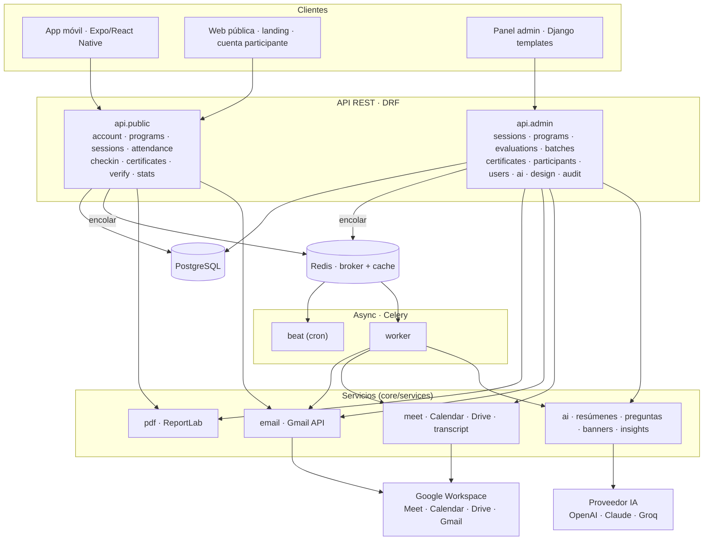

# CertifAI

> Plataforma de certificación académica con IA · Universidad Estatal de Milagro (UNEMI)

CertifAI gestiona el ciclo completo de la formación académica: **programas** y
**seminarios**, inscripción y asistencia con **QR**, **evaluaciones** con banco
de preguntas generado por IA, **generación masiva de certificados** en PDF,
**verificación pública** por código único, automatización de eventos virtuales
con **Google Meet/Calendar/Drive**, y **resúmenes + cuestionarios automáticos**
de las reuniones con IA (asistente "Betto").

Es un **monorepo**: backend Django (`server/`) + app móvil Expo/React Native (`mobile/`).


> App móvil · Backend Django · Celery/Redis · PostgreSQL · Google Workspace · IA · certificados con QR.

---

## Tabla de contenidos

- [Stack](#stack)
- [Arquitectura](#arquitectura)
- [Backend · módulos](#backend--módulos)
- [App móvil](#app-móvil)
- [Tareas asíncronas (Celery)](#tareas-asíncronas-celery)
- [Integraciones externas](#integraciones-externas)
- [Setup con Docker (recomendado)](#setup-con-docker-recomendado)
- [Setup local sin Docker](#setup-local-sin-docker)
- [Correr la app móvil](#correr-la-app-móvil)
- [Deploy en Railway](#deploy-en-railway)
- [Tests](#tests)
- [Estructura del repositorio](#estructura-del-repositorio)

---

## Stack

| Capa | Tecnología |
|---|---|
| **Backend** | Django 5.x + Django REST Framework |
| **Base de datos** | PostgreSQL 16 (prod y Docker) · SQLite (fallback dev) |
| **Cache + colas** | Redis · Celery (worker + beat) |
| **App móvil** | Expo / React Native (expo-router, TypeScript) |
| **Web** | Server-side rendering (Django Templates) + Tailwind (CDN) + JS vanilla |
| **Auth** | Sesión Django (panel admin) · JWT `simplejwt` (API) · token de participante (móvil) |
| **PDFs** | ReportLab (certificados individuales y de programa) |
| **IA** | OpenAI / Anthropic Claude / Groq (proveedor seleccionable, API OpenAI-compat) |
| **Google** | Workspace vía OAuth 2.0 — Meet · Calendar · Drive · Gmail |
| **Servidor** | gunicorn + WhiteNoise |
| **Deploy** | Docker Compose (local) · Railway / Nixpacks + Dockerfile (prod) |
| **Tests** | pytest + pytest-django |

---

## Arquitectura

**Patrón**: monolito modular en capas con API REST + cliente móvil. No son
microservicios — es **una sola app** con servicios de apoyo (DB, Redis, workers)
que en local corren con Docker Compose y en prod en un único servicio + Postgres.



---

## Backend · módulos

Django project en `server/config`. Apps como *bounded contexts*:

| App | Responsabilidad |
|---|---|
| `core` | Modelos de dominio, servicios, tasks Celery, comandos de gestión |
| `api/admin` | API REST autenticada (panel/gestión) |
| `api/public` | API REST pública / participante (móvil + web) |
| `admin_panel` | UI del panel administrativo (templates + vistas) |
| `public` | UI pública (landing, cuenta del participante, registro a eventos) |

**Módulos de la API pública** (`server/api/public/`): `account`, `programs`,
`sessions`, `attendance`, `checkin`, `certificates`, `verify`, `stats`.

**Módulos de la API admin** (`server/api/admin/`): `sessions`, `programs`,
`evaluations`, `batches`, `certificates`, `participants`, `users`, `ai`,
`design`, `firmas`, `search`, `dashboard`, `audit`.

**Dominio (`core/models`)** incluye, entre otros: `Program`, `Event` (seminario),
`Participant`, `Enrollment`, `Attendance`, `Evaluation` + `Question` +
`EvaluationAttempt`, `Certificate` + `CertificateBatch`, `Signature`,
`GlobalDesign`, `SessionSummary`, `AIConfig`, `GoogleCredential`.

---

## App móvil

Expo + expo-router en `mobile/`. Consume la **API pública** con autenticación
por token de participante.

- **Tabs**: Inicio, Eventos, Certificados, Asistencia (escáner QR), Perfil.
- **Pantallas**: detalle de evento (`event/[id]`), **detalle de programa**
  (`program/[id]`, con seminarios navegables), evaluación (`evaluation`),
  escáner QR (`scanner`), auth (login / registro / landing).
- La URL del backend se configura en [`mobile/app.json`](mobile/app.json) →
  `expo.extra.apiBaseUrl`.

---

## Tareas asíncronas (Celery)

Definidas en `server/core/tasks/`:

| Task | Módulo | Qué hace |
|---|---|---|
| `send_certificate_issued_bulk(lote_id)` | `email_tasks` | Notifica por Gmail a todos los del lote |
| `send_welcome_email_async(...)` | `email_tasks` | Correo de bienvenida |
| `send_event_inscription_async(...)` | `email_tasks` | Confirmación de inscripción |
| `issue_program_certificates_for_event(...)` | `program_tasks` | Emite certificados de programa al completar |
| `process_past_events()` | `program_tasks` | Barrido de eventos pasados (beat) |
| `process_event_transcript(...)` | `transcript_tasks` | Busca grabación en Drive → resumen + cuestionario IA |

En dev sin Redis: `CELERY_TASK_ALWAYS_EAGER=True` corre las tareas sincrónicas
dentro del request.

---

## Integraciones externas

- **IA** (`core/services/ai/`): `transcript_summary` (resúmenes "Betto"),
  `question_bank` (genera preguntas de evaluación desde el resumen, un documento
  o el título), `banner` (imágenes promocionales), `insights`, `recommender`,
  `skills`, `copilot`, `voice`. Proveedor configurable (OpenAI / Claude / Groq).
- **Google** (`core/services/meet/`): `oauth` (OAuth 2.0), `calendar_client`
  (crea/actualiza eventos), `drive_client` (busca grabaciones/transcripciones),
  `transcript_parser`. Callback admin: `/panel/google/callback/`.
- **Email**: Gmail API de la cuenta institucional (`core/services/email/`).

---

## Setup con Docker (recomendado)

El `docker-compose.yml` (en la raíz) levanta todo el stack; el backend vive en `server/`.

```bash
docker compose up -d --build          # web + db + redis + worker + beat
docker compose exec web python manage.py migrate
docker compose exec web python manage.py createsuperuser
docker compose logs -f web worker
docker compose down                   # apagar
```

| Servicio | Puerto host | Descripción |
|---|---|---|
| `web` | **8500** → 8000 | Django + gunicorn |
| `db` | **5433** → 5432 | PostgreSQL 16 |
| `redis` | **6380** → 6379 | Redis (broker + cache) |
| `worker` | — | Celery worker |
| `beat` | — | Celery beat (cron) |

App en **http://localhost:8500** · panel en **/panel/**.

Los secretos del backend se inyectan desde `server/.env` (ver `server/.env.example`).

---

## Setup local sin Docker

```bash
cd server
python -m venv ../venv && source ../venv/bin/activate
pip install -r requirements.txt
cp .env.example .env          # editar credenciales
python manage.py migrate
python manage.py createsuperuser
python manage.py runserver 0.0.0.0:8000
```

---

## Correr la app móvil

```bash
cd mobile
npm install
npx expo start                # QR para Expo Go, o i/a para simuladores
```

Ajustá `expo.extra.apiBaseUrl` en `mobile/app.json` para apuntar al backend
(local LAN `http://TU_IP:8500` o el dominio de producción).

Para un APK instalable sin Expo Go: `eas build -p android --profile preview`.

---

## Deploy en Railway

El backend se despliega desde `server/` (**Root Directory = `server`** en Railway).

- Servicios: **web** (este repo) + **PostgreSQL** (plugin). Redis + worker son
  opcionales (para tareas IA en segundo plano).
- Arranque: [`server/start.sh`](server/start.sh) → `migrate` (con reintento por
  la red privada) → `import_data` (carga inicial idempotente) → `ensure_admin`
  → `gunicorn` en `[::]:8000`.
- Variables mínimas: `SECRET_KEY`, `DEBUG=False`, `DATABASE_URL=${{Postgres.DATABASE_URL}}`.
  Para IA/Google: `GOOGLE_CLIENT_ID/SECRET`, `GOOGLE_REDIRECT_URI`, y la API key del proveedor IA.
- `ALLOWED_HOSTS`/`CSRF` aceptan cualquier `*.railway.app` automáticamente.

Ver la guía paso a paso en [`DEPLOY.md`](DEPLOY.md).

---

## Tests

```bash
cd server
pytest                        # con DEBUG=True SECRET_KEY=... en el entorno
```

El CI (GitHub Actions) corre `check`, `makemigrations --check` y `pytest` en
Python 3.10/3.11/3.12, además de `ruff`.

---

## Estructura del repositorio

```
certifai/
├── docker-compose.yml        → orquesta todo el stack local
├── mobile/                   → app Expo / React Native
│   └── app/                  → rutas (tabs, event, program, evaluation, auth)
├── server/                   → backend Django (unidad desplegable)
│   ├── config/               → settings · urls · celery · wsgi
│   ├── core/
│   │   ├── models/           → dominio (programas, eventos, certs, evaluaciones…)
│   │   ├── services/         → ai · meet · email · pdf
│   │   ├── tasks/            → tareas Celery
│   │   └── management/       → comandos (import_data, ensure_admin, …)
│   ├── api/{admin,public}/   → endpoints REST
│   ├── admin_panel/          → UI del panel
│   ├── public/               → UI pública + cuenta participante
│   ├── tests/                → pytest
│   ├── Dockerfile · requirements.txt · railway.json · start.sh · .env
│   └── manage.py
├── DEPLOY.md                 → guía de deploy en Railway
└── .github/workflows/ci.yml  → CI
```

---

## Licencia

Proyecto académico · Universidad Estatal de Milagro · 2026
