# Database Model · CertifAI

Entity-Relationship Diagram (ERD) generated from the current schema (English refactor).

> Rendering options:
> - **GitHub**: renders Mermaid automatically when opening this file in the repo.
> - **VSCode**: install _Markdown Preview Mermaid Support_ extension and open preview.
> - **Online (Mermaid)**: paste the Mermaid block at https://mermaid.live (Actions → Export PNG/SVG).
> - **Online (PlantUML)**: paste the PlantUML block at https://www.plantuml.com/plantuml/uml or https://plantuml.com.
> - **CLI (PlantUML)**: `brew install plantuml` → `plantuml docs/MODELO_BD.md` extracts the diagram.

---

## ERD · Mermaid (full)

```mermaid
erDiagram

    USER {
        int id PK
        string username UK
        string email
        string password
        string role "superadmin | admin"
        string faculty
        string phone
        bool is_active
        datetime date_joined
        datetime last_login
    }
    ACCESS_REQUEST {
        int id PK
        string first_name
        string last_name
        string email UK
        string phone
        string faculty
        string status "pending | approved | rejected"
        int created_user_id FK
        int approved_by_id FK
        datetime requested_at
        datetime responded_at
        text rejection_reason
    }

    FACULTY {
        int id PK
        string code UK
        string name
        text description
        int sort_order
        bool is_active
    }

    PARTICIPANT {
        int id PK
        string national_id UK
        string first_name
        string last_name
        string email UK
        string phone
        bool is_leader
        string password_hash
        image avatar
        datetime last_login
        datetime created_at
    }
    PARTICIPANT_TOKEN {
        int id PK
        int participant_id FK
        string key UK
        datetime expires_at
        datetime last_used_at
        string user_agent
    }

    CERTIFICATE_BATCH {
        int id PK
        string name
        int administrator_id FK
        string faculty
        file excel_file
        bool customize_design
        string template "classic | modern | geometric"
        string color_primary
        string color_secondary
        string color_tertiary
        string color_text
        text body_text
        float signatures_position
        int signature_inst_1_id FK
        int signature_inst_2_id FK
        int signature_inst_3_id FK
        int signature_inst_4_id FK
        bool is_active
        datetime created_at
    }
    CERTIFICATE {
        int id PK
        int batch_id FK
        int participant_id FK
        string national_id
        string first_name
        string last_name
        string email
        string phone
        string course
        date course_date
        int hours
        string verification_hash UK
        file pdf_file
        int download_count
        int search_count
        datetime last_download_at
        datetime created_at
    }
    SIGNATURE {
        int id PK
        string name
        string role
        text image "base64"
        bool is_active
        int sort_order
        datetime created_at
    }
    GLOBAL_DESIGN {
        int id PK
        string template
        string color_primary
        string color_secondary
        string color_tertiary
        string color_text
        text body_text
        float signatures_position
        int signature_inst_1_id FK
        int signature_inst_2_id FK
        int signature_inst_3_id FK
        float signature_1_offset_y
        float signature_1_scale
        float signature_2_offset_y
        float signature_2_scale
        datetime updated_at
    }

    EVENT {
        int id PK
        int batch_id FK
        string title
        text description
        image banner_image
        string modality "in_person | virtual"
        string virtual_platform "zoom | meet | teams | other"
        url meeting_url
        string location
        date date
        time start_time
        time end_time
        string qr_code UK
        int capacity
        bool leaders_only
        bool is_active
        string google_calendar_event_id
        bool transcription_enabled
        datetime created_at
    }
    SPEAKER {
        int id PK
        int event_id FK
        string name
        string title
        string affiliation
        text bio
        int sort_order
    }
    ATTENDANCE {
        int id PK
        int event_id FK
        int participant_id FK
        int certificate_id FK
        datetime registered_at
        ip ip_address
    }
    ENROLLMENT {
        int id PK
        int event_id FK
        int participant_id FK
        int certificate_id FK
        bool confirmed
        bool blocked
        datetime enrolled_at
    }

    SESSION_SUMMARY {
        int id PK
        int event_id FK
        string drive_file_id
        string drive_file_name
        text transcript_raw
        int transcript_chars
        text summary_md
        json key_points
        json next_steps
        json quiz
        int duration_minutes
        string status "pending | processing | ready | error"
        text error_msg
        string ai_model
        int ai_input_tokens
        int ai_output_tokens
        datetime created_at
        datetime processed_at
    }
    QUIZ_ATTEMPT {
        int id PK
        int participant_id FK
        int event_id FK
        int correct
        int total
        int total_time_seconds
        json answers
        datetime created_at
    }

    GOOGLE_CREDENTIAL {
        int id PK
        string email UK
        text access_token "encrypted"
        text refresh_token "encrypted"
        url token_uri
        string client_id
        string client_secret "encrypted"
        json scopes
        datetime expiry
        datetime created_at
    }
    AI_CONFIG {
        int id PK
        string provider "claude | openai | groq"
        string model
        string api_key "encrypted"
        float temperature
        int max_tokens
        text system_prompt_override
        bool enabled
        datetime updated_at
    }

    AUDIT_LOG {
        int id PK
        int user_id FK
        string action
        text details
        int content_type_id FK
        int object_id
        json changes
        ip ip
        string user_agent
        datetime created_at
    }
    UI_DESIGN_TOKENS {
        int id PK
        string color_brand
        string color_brand_dark
        string color_accent
        string color_bg_dark
        string color_bg_light
        string color_card_dark
        string color_card_light
        string color_text_dark
        string color_text_light
        string color_success
        string color_warning
        string font_sans
        string font_display
        string font_mono
        string radius_md
        string radius_xl
        string btn_blur
        string btn_saturate
        float btn_glass_opacity_dark
        float btn_glass_opacity_light
    }

    ACCESS_REQUEST ||--o| USER : "approved_as"
    ACCESS_REQUEST }o--o| USER : "approved_by"

    PARTICIPANT ||--o{ PARTICIPANT_TOKEN : "has_sessions"
    PARTICIPANT ||--o{ ENROLLMENT : "enrolls_in"
    PARTICIPANT ||--o{ ATTENDANCE : "attends"
    PARTICIPANT ||--o{ CERTIFICATE : "receives"
    PARTICIPANT ||--o{ QUIZ_ATTEMPT : "tries"

    CERTIFICATE_BATCH ||--o{ CERTIFICATE : "contains"
    CERTIFICATE_BATCH ||--o{ EVENT : "has_events"
    CERTIFICATE_BATCH }o--o| USER : "created_by"
    CERTIFICATE_BATCH }o--o| SIGNATURE : "signature_1_to_4"

    GLOBAL_DESIGN }o--o| SIGNATURE : "signature_1_to_3"

    EVENT ||--o{ SPEAKER : "has_speakers"
    EVENT ||--o{ ATTENDANCE : "attendances"
    EVENT ||--o{ ENROLLMENT : "enrollments"
    EVENT ||--|| SESSION_SUMMARY : "has_summary"
    EVENT ||--o{ QUIZ_ATTEMPT : "quiz_attempts"

    USER ||--o{ AUDIT_LOG : "performs_actions"
```



---

## ERD · PlantUML (alternativa visual)

```plantuml
@startuml CertifAI_ERD
!define ENTITY(name) entity name << (E,#e0f0ff) >>
!define VALUE(name) entity name << (V,#fff5e0) >>
!define SINGLETON(name) entity name << (S,#fce8ff) >>
!define CATALOG(name) entity name << (C,#e8ffe8) >>

skinparam linetype ortho
skinparam shadowing false
skinparam roundCorner 8
skinparam DefaultFontName "JetBrains Mono"
skinparam ArrowColor #555
hide circle

package "Identity & Access" {
  ENTITY(User) {
    * id : int <<PK>>
    --
    username : varchar <<UK>>
    email : varchar
    role : enum
    faculty : varchar
    phone : varchar
    is_active : bool
  }
  ENTITY(AccessRequest) {
    * id : int <<PK>>
    --
    first_name : varchar
    last_name : varchar
    email : varchar <<UK>>
    faculty : varchar
    status : enum
    rejection_reason : text
    created_user_id : FK → User
    approved_by_id : FK → User
  }
}

package "Catalogs" {
  CATALOG(Faculty) {
    * id : int <<PK>>
    --
    code : varchar <<UK>>
    name : varchar
    description : text
    sort_order : int
    is_active : bool
  }
}

package "Participants" {
  ENTITY(Participant) {
    * id : int <<PK>>
    --
    national_id : varchar <<UK>>
    first_name : varchar
    last_name : varchar
    email : varchar <<UK>>
    phone : varchar
    is_leader : bool
    password_hash : varchar
    avatar : image
  }
  ENTITY(ParticipantToken) {
    * id : int <<PK>>
    --
    participant_id : FK → Participant
    key : varchar <<UK>>
    expires_at : datetime
    user_agent : varchar
  }
}

package "Certificates" {
  ENTITY(CertificateBatch) {
    * id : int <<PK>>
    --
    name : varchar
    administrator_id : FK → User
    faculty : varchar
    template : enum
    customize_design : bool
    color_primary/secondary/tertiary/text : hex
    body_text : text
    signature_inst_1..4_id : FK → Signature
    is_active : bool
  }
  ENTITY(Certificate) {
    * id : int <<PK>>
    --
    batch_id : FK → CertificateBatch
    participant_id : FK → Participant
    national_id : varchar
    first_name / last_name : varchar
    email : varchar
    course : varchar
    course_date : date
    hours : int
    verification_hash : varchar <<UK>>
    pdf_file : file
    download_count : int
    search_count : int
  }
  ENTITY(Signature) {
    * id : int <<PK>>
    --
    name : varchar
    role : varchar
    image : text (base64)
    is_active : bool
    sort_order : int
  }
  SINGLETON(GlobalDesign) {
    * id : int <<PK>> (=1)
    --
    template : enum
    color_primary/secondary/... : hex
    body_text : text
    signature_inst_1..3_id : FK → Signature
    signature_1_offset_y / scale : float
    signature_2_offset_y / scale : float
  }
}

package "Events & Attendance" {
  ENTITY(Event) {
    * id : int <<PK>>
    --
    batch_id : FK → CertificateBatch
    title : varchar
    description : text
    modality : enum (in_person | virtual)
    virtual_platform : enum
    meeting_url : url
    location : varchar
    date : date
    start_time / end_time : time
    qr_code : varchar <<UK>>
    capacity : int
    leaders_only : bool
    is_active : bool
    transcription_enabled : bool
    google_calendar_event_id : varchar
  }
  ENTITY(Speaker) {
    * id : int <<PK>>
    --
    event_id : FK → Event
    name : varchar
    title : varchar
    affiliation : varchar
    bio : text
    sort_order : int
  }
  ENTITY(Attendance) {
    * id : int <<PK>>
    --
    event_id : FK → Event
    participant_id : FK → Participant
    certificate_id : FK → Certificate
    registered_at : datetime
    ip_address : ip
  }
  ENTITY(Enrollment) {
    * id : int <<PK>>
    --
    event_id : FK → Event
    participant_id : FK → Participant
    certificate_id : FK → Certificate
    confirmed : bool
    blocked : bool
    enrolled_at : datetime
  }
}

package "AI Pipeline" {
  ENTITY(SessionSummary) {
    * id : int <<PK>>
    --
    event_id : FK → Event <<1:1>>
    drive_file_id : varchar
    transcript_raw : text
    summary_md : text
    key_points : json
    next_steps : json
    quiz : json
    status : enum
    ai_model : varchar
    ai_input_tokens / ai_output_tokens : int
  }
  ENTITY(QuizAttempt) {
    * id : int <<PK>>
    --
    participant_id : FK → Participant
    event_id : FK → Event
    correct / total : int
    total_time_seconds : int
    answers : json
  }
}

package "Integrations (encrypted at rest)" {
  ENTITY(GoogleCredential) {
    * id : int <<PK>>
    --
    email : varchar <<UK>>
    access_token : <<encrypted>>
    refresh_token : <<encrypted>>
    client_id : varchar
    client_secret : <<encrypted>>
    scopes : json
    expiry : datetime
  }
  SINGLETON(AIConfig) {
    * id : int <<PK>> (=1)
    --
    provider : enum (claude | openai | groq)
    model : varchar
    api_key : <<encrypted>>
    temperature : float
    max_tokens : int
    enabled : bool
  }
}

package "Cross-cutting" {
  ENTITY(AuditLog) {
    * id : int <<PK>>
    --
    user_id : FK → User
    action : varchar
    content_type_id : FK
    object_id : bigint
    changes : json
    ip : ip
    user_agent : varchar
    created_at : datetime
  }
  SINGLETON(UIDesignTokens) {
    * id : int <<PK>> (=1)
    --
    color_brand / brand_dark / accent : hex
    color_bg_dark / bg_light : hex
    color_card_dark / card_light : hex
    color_text_dark / text_light : hex
    font_sans / display / mono : varchar
    radius_md / xl : varchar
    btn_blur / saturate : varchar
    btn_glass_opacity_dark / light : float
  }
}

' ─── Relationships ──────────────────────────────────────────
AccessRequest "0..1" --> "1" User : approved_as
AccessRequest "0..*" --> "0..1" User : approved_by

Participant "1" --> "0..*" ParticipantToken
Participant "1" --> "0..*" Enrollment
Participant "1" --> "0..*" Attendance
Participant "1" --> "0..*" Certificate
Participant "1" --> "0..*" QuizAttempt

CertificateBatch "1" --> "0..*" Certificate
CertificateBatch "1" --> "0..*" Event
CertificateBatch "0..*" --> "0..1" User : administrator
CertificateBatch "0..*" --> "0..1" Signature : signature_inst_1..4

GlobalDesign "1" --> "0..1" Signature : signature_inst_1..3

Event "1" --> "0..*" Speaker
Event "1" --> "0..*" Attendance
Event "1" --> "0..*" Enrollment
Event "1" --> "1" SessionSummary : 1:1
Event "1" --> "0..*" QuizAttempt

User "1" --> "0..*" AuditLog

@enduml
```



---

## Legend

| Notation | Meaning |
|---|---|
| `PK` | Primary Key |
| `UK` | Unique Key (UNIQUE constraint) |
| `FK` | Foreign Key |
| `<<encrypted>>` | Field encrypted at rest with **Fernet** (AES-128 + HMAC) — transparent read/write via `EncryptedCharField` / `EncryptedTextField`. |
| `Singleton` | Model with exactly **1 row** (PK = 1) — config-style. |

### Mermaid cardinalities

| Notation | Meaning |
|---|---|
| `||--o{` | One to many (1:N) |
| `||--||` | One to one mandatory (1:1) |
| `||--o|` | One to one optional |
| `}o--o|` | Many to one optional |

---

## Schema summary

| Metric | Value |
|---|---|
| Total tables | **19** |
| Lookup catalogs | 1 (`Faculty`) |
| Singletons | 3 (`GlobalDesign`, `AIConfig`, `UIDesignTokens`) |
| 1:1 relations | 2 (`Event ↔ SessionSummary`, `AccessRequest ↔ User`) |
| Main 1:N relations | 13 |
| Encrypted fields (Fernet) | 4 (`AIConfig.api_key` + 3 in `GoogleCredential`) |
| Declared indexes | ~25 |

---

## Functional domains

```
IDENTITY & ACCESS         CATALOGS
 - User                    - Faculty
 - AccessRequest           - (TextChoices: role, modality, ...)
       |
       v
 PARTICIPANTS
  - Participant
  - ParticipantToken
       |
       +----------------+----------------+
       v                v                v
 CERTIFICATES      EVENTS           AI PIPELINE
  - CertificateBatch  - Event         - SessionSummary
  - Certificate       - Speaker       - QuizAttempt
  - Signature         - Enrollment          |
  - GlobalDesign      - Attendance          v
                                      INTEGRATIONS (encrypted)
                                       - GoogleCredential
                                       - AIConfig

 AUDIT LOG (cross-cutting via ContentType + JSON diff)
```

---

## Main flows

### 1 · Certification

```
Admin → creates CertificateBatch → uploads Excel
       |
       v
   generates N×Certificate (one per Participant)
       |
       v
   Anyone verifies at /verify/<hash>/  ⇒ search_count++
       |
       v
   Participant downloads PDF  ⇒ download_count++, last_download_at
```

### 2 · Event + attendance

```
Admin → creates Event (with Speakers)
       |
       v
   Participant scans QR  →  Attendance row
       |
       v
   If transcription_enabled:
       Celery Beat (every 30 min) → fetches Drive transcript
           → produces SessionSummary (status = ready)
       |
       v
   Participant takes quiz  →  QuizAttempt (max 2 per participant)
```

### 3 · AI pipeline

```
Event
   --> SessionSummary (1:1)
         - summary_md (Markdown)
         - key_points (JSON list)
         - next_steps (JSON list)
         - quiz (JSON: questions + options + correct_idx)
              --> QuizAttempt (N per Participant)
```

---

## Spanish → English rename map

For reference when reading older commits or scripts:

| Old (Spanish) | New (English) |
|---|---|
| `Usuario` | `User` |
| `SolicitudAcceso` | `AccessRequest` |
| `Facultad` | `Faculty` |
| `Participante` | `Participant` |
| `ParticipanteToken` | `ParticipantToken` |
| `LoteCertificados` | `CertificateBatch` |
| `Certificado` | `Certificate` |
| `FirmaInstitucional` | `Signature` |
| `DisenoGlobal` | `GlobalDesign` |
| `SesionAsistencia` | `Event` |
| `Ponente` | `Speaker` |
| `RegistroAsistencia` | `Attendance` |
| `ConfirmacionAsistencia` | `Enrollment` |
| `ResumenSesion` | `SessionSummary` |
| `IntentoCuestionario` | `QuizAttempt` |
| `Auditoria` | `AuditLog` |

Common field renames:

| Old | New |
|---|---|
| `nombres` | `first_name` |
| `apellidos` | `last_name` |
| `cedula` | `national_id` |
| `celular` | `phone` |
| `es_lider` | `is_leader` |
| `titulo` | `title` |
| `descripcion` | `description` |
| `modalidad` | `modality` |
| `fecha` | `date` |
| `hora_inicio` / `hora_fin` | `start_time` / `end_time` |
| `lugar` | `location` |
| `capacidad` | `capacity` |
| `solo_lideres` | `leaders_only` |
| `activa` / `activo` | `is_active` |
| `enlace_virtual` | `meeting_url` |
| `imagen_banner` | `banner_image` |
| `codigo_qr` | `qr_code` |
| `transcripcion_habilitada` | `transcription_enabled` |
| `nombre_lote` | `name` |
| `administrador` | `administrator` |
| `cuerpo_certificado` | `body_text` |
| `color_primario` / `secundario` / `terciario` / `texto` | `color_primary` / `secondary` / `tertiary` / `text` |
| `hash_verificacion` | `verification_hash` |
| `pdf_generado` | `pdf_file` |
| `descargas_count` | `download_count` |
| `veces_buscado` | `search_count` |
| `fecha_curso` / `horas` | `course_date` / `hours` |
| `archivo_excel` | `excel_file` |
| `personalizar_diseno` | `customize_design` |
| `plantilla` | `template` |
| `posicion_firmas` | `signatures_position` |
| `firma_inst_1..4` | `signature_inst_1..4` |
| `fecha_registro` | `registered_at` |
| `fecha_confirmacion` | `enrolled_at` |
| `bloqueado` | `blocked` |
| `resumen_md` | `summary_md` |
| `puntos_clave` | `key_points` |
| `proximos_pasos` | `next_steps` |
| `cuestionario` | `quiz` |
| `duracion_minutos` | `duration_minutes` |
| `procesado_at` | `processed_at` |
| `correctas` / `tiempo_total_seg` | `correct` / `total_time_seconds` |
| `respuestas` | `answers` |
| `accion` / `detalle` / `cambios` | `action` / `details` / `changes` |
| `fecha` (en Auditoria) | `created_at` |
| `*_cifrado` | `*` (campo + tipo `EncryptedCharField`/`EncryptedTextField`) |
| `Modalidad.PRESENCIAL` / `VIRTUAL` | `EventModality.IN_PERSON` / `VIRTUAL` |
| `Plantilla.CLASICO` | `CertificateTemplate.CLASSIC` |
| `Rol.SUPERADMIN` / `ADMIN` | `AdminRole.SUPERADMIN` / `ADMIN` |
| `EstadoSolicitud.PENDIENTE` / `APROBADA` / `RECHAZADA` | `AccessRequestStatus.PENDING` / `APPROVED` / `REJECTED` |

---

## Outstanding refactor backlog

| # | Improvement | Impact |
|---|---|---|
| 1 | `CertificateBatch.signature_inst_1..4` (and `GlobalDesign.signature_inst_1..3`) → pivot table `BatchSignature(batch_id, signature_id, slot)` | Normalization (1NF) |
| 2 | `Signature.image` as base64 `TextField` → `ImageField` with file in `media/signatures/` | Performance + storage cost |
| 3 | `Attendance.certificate` and `Attendance.participant` nullable — both should be required after migration cleanup | Data integrity |
| 4 | `UIDesignTokens` is large (~30 columns) — consider splitting into `UIThemeDark` / `UIThemeLight` siblings | Read clarity |
